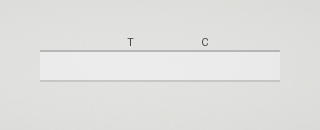
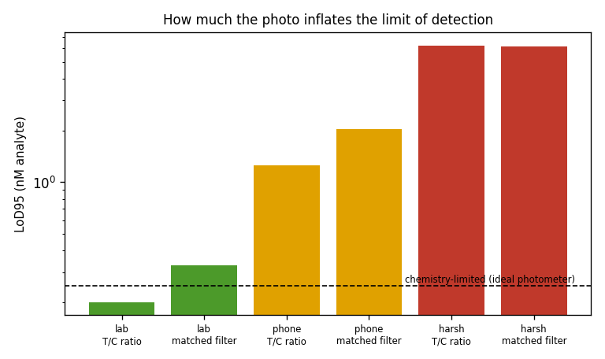
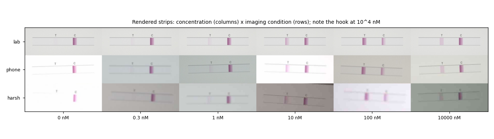
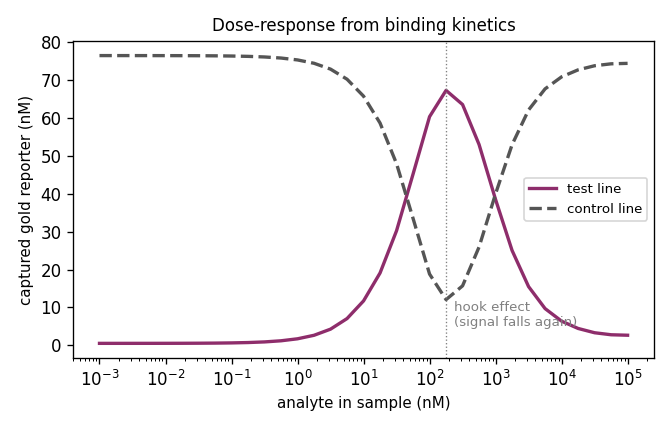

# stripsim

[](https://github.com/hxlvvm/stripsim/actions/workflows/tests.yml)

**A lateral-flow test simulator that runs from binding kinetics to a phone photo and gives a limit of
detection in concentration units.**

Smartphone apps that read rapid tests (COVID, HIV, malaria, pregnancy) are usually validated on a small
set of photos. Physics models of the assay are mature but stop at "captured particles". Synthetic test
images exist, but their line darkness is a free setting with no chemistry behind it.

`stripsim` connects the two:

**binding kinetics → captured gold → membrane optics → camera → rendered photo → reader → limit of
detection (nM)**

That lets you ask how much a reader, or a photo taken in bad light, inflates the detection limit, measured
in analyte concentration.



*A 2 nM sample wicking along the strip. The control line and the test line develop as the gold reporter is
captured.*

## Findings

LoD95 is the concentration detected with 95 % probability. It comes from 390 simulated tests with
test-to-test chemistry variation: 60 blanks plus 11 concentrations × 30. Each test is photographed under
three conditions.

| reader | lab light | typical phone photo | harsh conditions |
|---|---|---|---|
| T/C ratio | 0.20 nM | **1.25 nM (5×)** | 6.2 nM (25×) |
| matched filter | 0.33 nM | 2.05 nM (8×) | 6.2 nM (25×) |
| *reading the captured gold directly ("ideal photometer")* | *0.25 nM* | | |

- **A typical phone photo costs a factor of 5–8 in detection limit, and harsh conditions cost 25.** That
  is the imaging-induced LoD inflation, separated from the assay chemistry.
- **The T/C ratio beats the "ideal" photometer in good light** (0.20 vs 0.25 nM). Dividing by the control
  line cancels test-to-test variation in how much reporter was loaded. That is why ratio readers are
  standard, and the effect emerges here without being designed in.
- **Under phone conditions, the ratio is more robust than the matched filter.** The ratio cancels lighting
  and exposure; an absolute line strength does not.
- **The high-dose hook effect emerges from the kinetics.** The test line peaks near 180 nM and drops to 4 %
  of its peak at 10⁵ nM. Free analyte saturates both the capture antibody and the reporter before
  sandwiches can form.





## How it works

1. **Assay** (`stripsim.assay`), following the structure of Qian & Bau (2003):
   - The liquid front wicks along the strip by Lucas–Washburn.
   - Analyte, gold reporter and complex move by advection, with reversible binding A + P ⇌ PA.
   - Sandwich capture happens at the test line, plus a little non-specific sticking, which is why blanks
     are not perfectly blank.
   - The control line captures reporter regardless of analyte.
   - Each binding step uses the exact solution of second-order kinetics, so the solver is stable even at
     10⁵ nM.
2. **Optics** (`stripsim.image`):
   - Kubelka–Munk reflectance of the nitrocellulose membrane, with gold-nanoparticle plasmon absorption
     near 525 nm. Lines therefore look red-purple.
   - The membrane is slightly darker where it is wet.
3. **Camera**:
   - illuminant colour temperature and imperfect white balance;
   - exposure error, vignetting and shadow;
   - Poisson–Gaussian sensor noise and sRGB gamma;
   - blur, rotation and offset, and JPEG compression.
   - Each condition (`LAB`, `PHONE`, `HARSH`) is a seeded distribution of these nuisances.
4. **Readers** (`stripsim.readers`):
   - **T/C ratio**: background-subtracted peak areas.
   - **Matched filter**: line template correlation divided by the noise.
   - Both read the photo at the nominal test- and control-line positions, with a small search window.
5. **LoD**:
   - LoB is the 95th percentile of blank scores.
   - LoD95 comes from a maximum-likelihood probit fit of detection rate against log concentration, in the
     spirit of CLSI EP17.

```bash
pip install -e ".[examples,dev]"
pytest -q                      # 7 tests, ~10 s
python examples/lod_study.py   # all figures and the table above (~10 min on one CPU core)
```

```python
from stripsim import run, render, PHONE, tc_ratio
r = run(1.0)                                        # 1 nM sample, 10-minute test
photo = render(r.gold[-1], r.x, r.front[-1], PHONE) # (170, 480, 3) uint8 phone photo
tc_ratio(photo)
```

## Validation

Tests check:
- reporter conservation before it reaches the absorbent pad;
- a linear low-dose response;
- the hook effect;
- Lucas–Washburn front motion;
- membrane optics (white membrane, purple lines);
- that each reader separates blanks from positives;
- recovery of a known probit by the LoD fit.

## Limitations

- **Kinetic and optical parameters are literature-typical, not a specific commercial test.** Read the
  results as relative (how much imaging inflates the LoD), not as the LoD of any product.
- 1D transport, uniform flow behind the front, and a continuous sample supply.
- Three effective RGB wavelengths instead of full spectra; procedural cassette rendering.
- No validation against real phone photos yet; a small set of real photos would be the natural v0.2 check.

## Related work

- Qian S., Bau H.H. *A mathematical model of lateral flow bioreactions applied to sandwich assays.* Anal
  Biochem 322:89, 2003. [doi:10.1016/j.ab.2003.07.011](https://doi.org/10.1016/j.ab.2003.07.011)
  (the assay-kinetics structure used here)
- Rogers E. et al. *Synthetic data to lower barriers towards equitable artificial intelligence in rapid
  diagnostic test interpretation* (SynSight). medRxiv 2025.
  [doi:10.1101/2025.02.25.25322677](https://doi.org/10.1101/2025.02.25.25322677)
  - The closest prior work: synthetic rapid-test images rendered in Unity with randomised lighting and
    pose.
  - There, line intensity is a free opacity setting. In `stripsim` it comes from analyte concentration
    through the kinetics, which is what makes an LoD in nM possible.

## License

MIT
